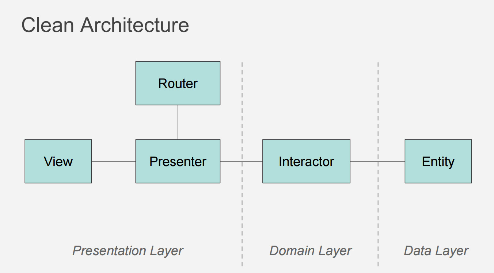

# Clean architecture



* Terdiri dari 3 layer: presentation layer, domain layer, dan data layer.
* Presentation layer meliputi : routing, payload request dan payload response.
* Domain layer meliputi : use case yang berisi interaction dan logic
* Data layer meliputi : entity / model 
* Untuk mengadopsi clean architecture, dibuat struktur direktori aplikasi sebagai berikut :

```text
> cmd
> controllers
> libraries
> models
> payloads
    > request
    > response
> schema
> usecases
```

* Implementasi tidak harus kaku. Tidak semua endpoint harus ada use case. Pattern use case digunakan jika mengandung banyak logic, atau melibatkan banyak model. Jika endpoint sederhana dengan hanya 1 model, tidak perlu membuat use case.
* Dalam contoh list user, karena masih sederhana, kita tidak akan menggunakan use case.
* Kita akan memecah kode di file main.go menjadi 5 file yaitu :

```text
main.go -> berisi kode untuk handling start up dan shutdown 
cmd/main.go -> berisi kode untuk handling console command, yaitu migrate dan seed
libraries/database/database.go -> berisi kode untuk membuat koneksi database
controllers/users.go -> berisi struct Users dan method List handler 
models/user.go -> berisi struct User dan method List untuk mendapatkan data list user dari database
payloads/response/user_response.go -> Format json response dari list user
```

* Berikut isi dari file libraries/database/database.go

```text
package database

import "database/sql"

//Open : open database
func Open() (*sql.DB, error) {
    return sql.Open("mysql", "root:pass@tcp(localhost:3306)/essentials?parseTime=true")
}
```

* Berikut isi dari file cmd/main.go

```text
package main

import (
    "essentials/libraries/database"
    "essentials/schema"
    "flag"
    "log"
    "os"

    _ "github.com/go-sql-driver/mysql"
)

func main() {
    // Start Database
    db, err := database.Open()
    if err != nil {
        log.Fatalf("error: connecting to db: %s", err)
    }
    defer db.Close()

    // Handle cli command
    flag.Parse()

    switch flag.Arg(0) {
    case "migrate":
        if err := schema.Migrate(db); err != nil {
            log.Println("error applying migrations", err)
            os.Exit(1)
        }
        log.Println("Migrations complete")
        return

    case "seed":
        if err := schema.Seed(db); err != nil {
            log.Println("error seeding database", err)
            os.Exit(1)
        }
        log.Println("Seed data complete")
        return
    }
}
```

* Berikut isi dari file models/user.go

```text
package models

import (
    "database/sql"
)

// User : struct of User
type User struct {
    ID       uint
    Username string
    Password string
    Email    string
    IsActive bool
}

const qUser = `SELECT id, username, password, email, is_active FROM users`

// List of users
func (u *User) List(db *sql.DB) ([]User, error) {
    var list []User

    rows, err := db.Query(qUser)
    if err != nil {
        return list, err
    }

    defer rows.Close()

    for rows.Next() {
        var user User
        if err := rows.Scan(&user.ID, &user.Username, &user.Password, &user.Email, &user.IsActive); err != nil {
            return list, err
        }
        list = append(list, user)
    }

    return list, rows.Err()
}
```

* Berikut adalah isi dari file payloads/response/user\_response.go

```text
package response

import "essentials/models"

// UserResponse struct for response of user
type UserResponse struct {
    ID       uint   `json:"id"`
    Username string `json:"username"`
    Email    string `json:"email"`
    IsActive bool   `json:"is_active"`
}

// Transform from models.User to UserResponse
func (u *UserResponse) Transform(user models.User) {
    u.ID = user.ID
    u.Username = user.Username
    u.Email = user.Email
    u.IsActive = user.IsActive
}
```

* Berikut isi file controllers/users.go

```text
package controllers

import (
    "database/sql"
    "encoding/json"
    "essentials/models"
    "essentials/payloads/response"
    "log"
    "net/http"
)

// Users : struct for set Users Dependency Injection
type Users struct {
    Db *sql.DB
}

// List : http handler for returning list of users
func (u *Users) List(w http.ResponseWriter, r *http.Request) {
    user := new(models.User)
    list, err := user.List(u.Db)
    if err != nil {
        log.Println("error get list user", err)
        w.WriteHeader(http.StatusInternalServerError)
        return
    }

    var responseList []response.UserResponse
    for _, l := range list {
        var res response.UserResponse
        res.Transform(l)
        responseList = append(responseList, res)
    }

    data, err := json.Marshal(responseList)
    if err != nil {
        log.Println("error marshalling result", err)
        w.WriteHeader(http.StatusInternalServerError)
        return
    }

    w.Header().Set("Content-Type", "application/json; charset=utf-8")
    w.WriteHeader(http.StatusOK)
    if _, err := w.Write(data); err != nil {
        log.Println("error writing result", err)
    }
}
```

* Dan isi dari file main.go adalah :

```text
package main

import (
    "context"
    "essentials/controllers"
    "essentials/libraries/database"
    "log"
    "net/http"
    "os"
    "os/signal"
    "syscall"
    "time"

    _ "github.com/go-sql-driver/mysql"
)

func main() {
    // =========================================================================
    // App Starting

    log.Printf("main : Started")
    defer log.Println("main : Completed")

    // =========================================================================

    // Start Database

    db, err := database.Open()
    if err != nil {
        log.Fatalf("error: connecting to db: %s", err)
    }
    defer db.Close()

    // Create variable service with pattern dependency injection.
    // Inject koneksion db to type of Users
    service := controllers.Users{Db: db}

    // parameter server
    server := http.Server{
        Addr:         "0.0.0.0:9000",
        Handler:      http.HandlerFunc(service.List),
        ReadTimeout:  5 * time.Second,
        WriteTimeout: 5 * time.Second,
    }

    serverErrors := make(chan error, 1)
    // mulai listening server
    go func() {
        log.Println("server listening on", server.Addr)
        serverErrors <- server.ListenAndServe()
    }()

    // Membuat channel untuk mendengarkan sinyal interupsi/terminate dari OS.
    // Menggunakan channel buffered karena paket signal membutuhkannya.
    shutdown := make(chan os.Signal, 1)
    signal.Notify(shutdown, os.Interrupt, syscall.SIGTERM)

    // Mengontrol penerimaan data dari channel,
    // jika ada error saat listenAndServe server maupun ada sinyal shutdown yang diterima
    select {
    case err := <-serverErrors:
        log.Fatalf("error: listening and serving: %s", err)

    case <-shutdown:
        log.Println("caught signal, shutting down")

        // Jika ada shutdown, meminta tambahan waktu 5 detik untuk menyelesaikan proses yang sedang berjalan.
        const timeout = 5 * time.Second
        ctx, cancel := context.WithTimeout(context.Background(), timeout)
        defer cancel()

        if err := server.Shutdown(ctx); err != nil {
            log.Printf("error: gracefully shutting down server: %s", err)
            if err := server.Close(); err != nil {
                log.Printf("error: closing server: %s", err)
            }
        }
    }

    log.Println("done")
}
```

